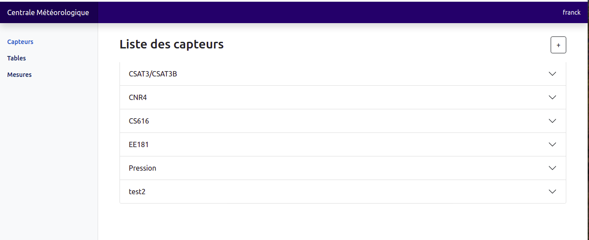
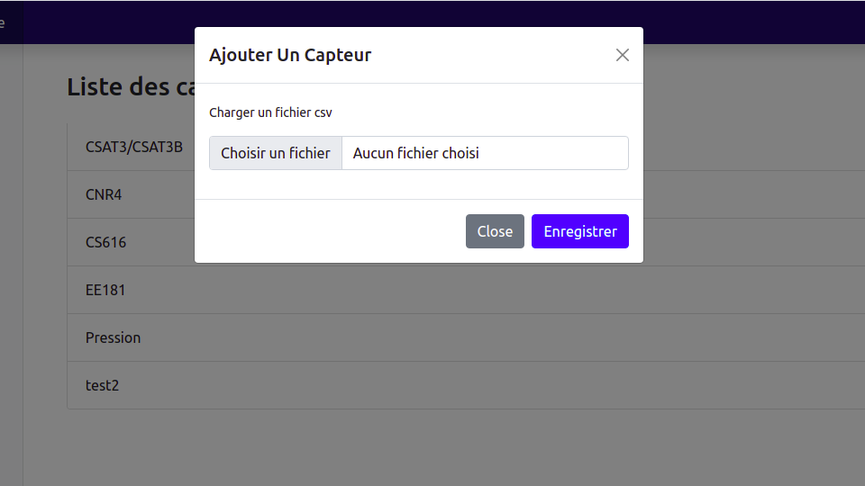
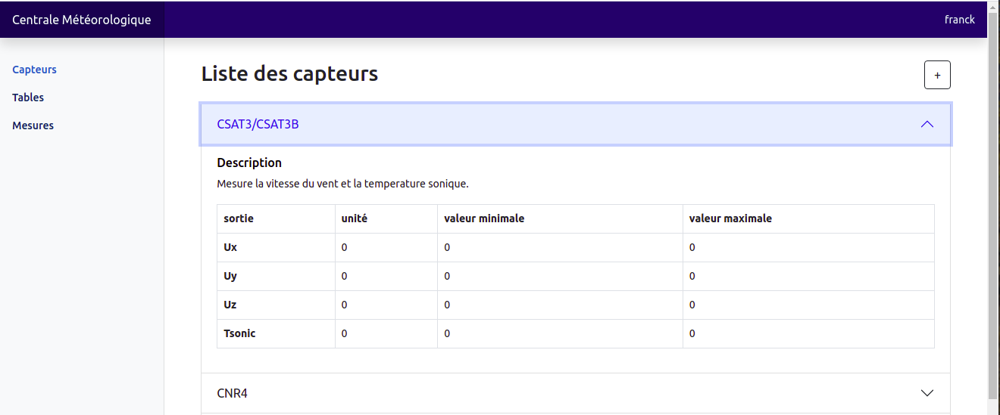

# centrale-meteorologique-IMSP

 Une interface entièrement faite en Javascript (Mithril js)
Un framework puissant, efficace, rapide en exécution. Le server est en node js 

### <a href="https://mithril.js.org/"> Un tour sur mithril js </a>

